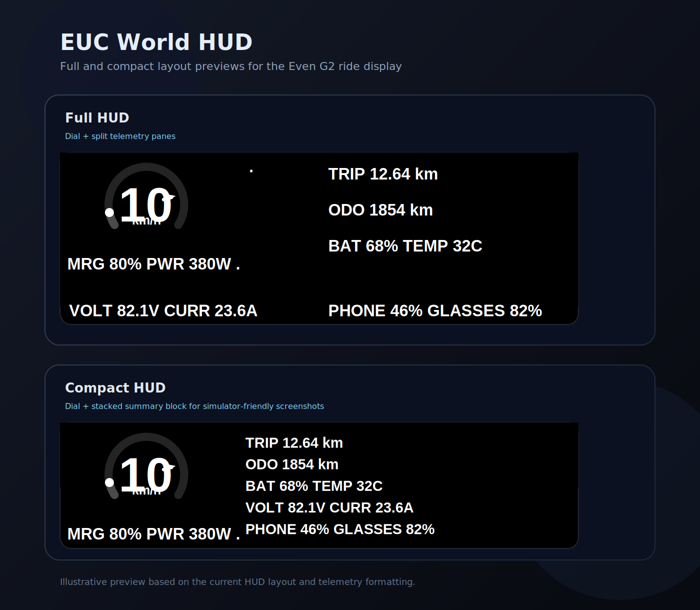

# EUC World HUD for Even G2 Glasses

Displays a mixed **fast/slow ride HUD** from **EUC World** on your **Even G2** smart glasses.

- **Fast pane**: speed dial, safety-margin marker, `MRG/PWR`, heartbeat
- **Slow pane**: trip, odometer, wheel battery, temperature, voltage/current, phone battery, glasses battery
- **Compact mode**: startup/simulator layout with a stacked summary block that reads more like the full HUD in screenshots
- **Critical-only mode**: hides the slow pane and leaves only the fast ride view



Fast telemetry is polled every **100 ms**. The non-critical text pane refreshes on a slower cadence (about **2 seconds**) to reduce rendering overhead on the glasses.

---

## Prerequisites

| Requirement | Notes |
|-------------|-------|
| Even G2 glasses | Paired to your Android phone via Even Realities app |
| EUC World | Running on the same phone as the Even app |
| Node.js 20+ | Recommended for local development/builds |
| Your phone & host on the same Wi-Fi | Needed when serving locally from your PC |
| Docker (optional) | For static server deployment via `docker compose` |

---

## Quick Start

### 1. Enable EUC World's Web Server

Open **EUC World → Settings → Web Server** and turn it on.  
Note the **port number** (commonly `8080`).

### 2. Install & run this plugin

```bash
npm install
npm run dev
# → server starts at http://0.0.0.0:5173
```

### 3. Sideload onto your glasses

Find your phone's local IP address (Settings → Wi-Fi → your network).

```bash
# Replace 192.168.1.XXX with your phone's actual IP
npm run qr -- "http://192.168.1.XXX:5173"
```

Scan the QR code with the **Even Realities app** on your phone.

### 4. Configure the URL (if needed)

The phone-side companion screen now includes:

- **Test**: probes common localhost variants
- **Apply**: reconnects using the selected port
- **Manual URL override**: forces a specific base URL
- **Use Simulator Data**: starts the built-in mock EUC World source
- **Show Critical Only**: phone-side fallback for clean mode
- **Last EvenHub event**: raw event inspector for tap/gesture debugging

Default probing still targets port `8080`, but the app will try multiple host variants automatically.

---

## Troubleshooting

| Symptom | Fix |
|---------|-----|
| "No signal" on glasses | EUC World web server not enabled, or wrong port |
| Glasses show nothing | Bridge not connected — check Even app is open |
| All values show `--` | Wheel not connected to EUC World |
| Tick count stays at `0` | The runtime is not polling — reconnect from the companion screen and confirm the bridge is live |
| Wrong or missing fields | Use the raw JSON panel to inspect the payload actually coming from EUC World |
| Tap/gesture behavior is odd | Use the **Last EvenHub event** panel to inspect what the glasses are sending |

### EUC World API Notes

The plugin currently handles multiple `/api/values` shapes:

- **Flat fields** at the root
- **Nested wrappers** like `data`, `payload`, `result`, `response`, `wheel`, `telemetry`, or `stats`
- **Coded `values[]` payloads** used by newer EUC World builds

Important mappings in the current HUD include:

- `vsp` → speed
- `vsmg` / `vsmn` → safety margin
- `vpo` / `vpn` / `vpx` → power
- `vvo` / `vvn` / `vvx` → voltage
- `vcu` / `vcn` / `vcx` → current
- `vbf` / `vba` / `vbm` / `vbx` → wheel battery
- `vte` / `vtn` / `vtx` → temperature
- `vdi` / `vdt` → trip / odometer
- `pba` → phone battery

Glasses battery is **not** sourced from EUC World; it comes from the Even SDK device status callbacks.

---

## Project Structure

```
euc-world-g2/
├── src/
│   ├── main.ts        ← bootstrap entrypoint
│   ├── plugin.ts      ← runtime orchestration and bridge lifecycle
│   ├── telemetry.ts   ← EUC World probing, fetch, simulator, parsing
│   ├── hud.ts         ← HUD rendering, text/image updates, event parsing
│   ├── layout.ts      ← EvenHub container layout definitions
│   ├── config.ts      ← shared runtime constants and layout config
│   ├── utils.ts       ← shared formatting and data helpers
│   └── types.ts       ← global window hooks and shared TS types
├── index.html         ← phone-side companion UI
├── Dockerfile
├── .dockerignore
├── docker-compose.yml
├── app.json           ← Even Hub app manifest
├── package.json
├── vite.config.ts
└── tsconfig.json
```

---

## Packaging for Distribution

```bash
npm run build
npm run pack
# → produces euc-world-g2.ehpk
```

Upload `euc-world-g2.ehpk` to [hub.evenrealities.com](https://hub.evenrealities.com) to share with other riders.

---

## Docker Deployment

Build and run the production static site with Docker:

```bash
docker compose up --build -d
```

The app will be served on:

```text
http://localhost:8080
```

If port `8080` is already in use on your server, change the host side of the port mapping in `docker-compose.yml`, for example:

```yaml
ports:
  - "18080:80"
```

To stop it:

```bash
docker compose down
```

---

## Resources

- [Even Hub Developer Docs](https://hub.evenrealities.com/docs/)
- [Even Hub SDK (npm)](https://www.npmjs.com/package/@evenrealities/even_hub_sdk)
- [EUC World](https://euc.world/)
- [EUC Community Forum](https://forum.electricunicycle.org/)
